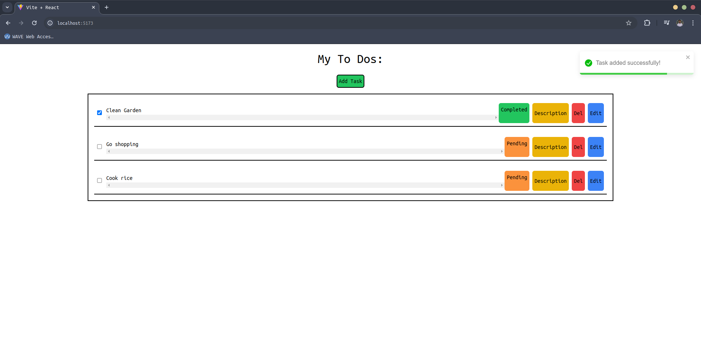

# ToDo App

This is a todo application built with React on the frontend and Node.js, Express, and Redis on the backend. This application is developed for an internship assignment. The user can:

-   Add tasks
-   Delete tasks
-   Edit tasks
-   Complete or un-complete tasks
-   Show task descriptions
-   Task data remains persistent with the database

# How to Set Up Locally

1. Clone the repository:

```sh
   git clone git@github.com:muditchoudhary/ToDoApp.git
```

2. Change directory to the project:

```sh
   cd ToDoApp
```

3. Install frontend dependencies:

```sh
   cd client
   npm install
```

(Ensure you have Node.js version v20.11.1 or at least Node.js 18)

4. Install backend dependencies:

```sh
    cd ../server
    npm install
```

(Ensure you have Node.js version v20.11.1 or at least Node.js 18)

# Install redis

Redis is used for data storage. You need to install Redis server on your machine.

-   I have used redis to you need to install redis-server in your machine.

## For ubuntu

Follow this guide: [Guide for Linux](https://redis.io/docs/latest/operate/oss_and_stack/install/install-stack/linux/)
Follow the instructions in the From the official Debian/Ubuntu APT Repository section.

## For Mac

Follow this guide:: [Guide for Mac](https://redis.io/docs/latest/operate/oss_and_stack/install/install-redis/install-redis-on-mac-os/)

# Check Successful Redis Installation

To check if Redis has been successfully installed, type:

```sh
   redis-server -v
```

to check the Redis server version.

# Running the Application

1. Open a terminal window and start the Redis server by typing:

```sh
   redis-server
```

2. Start the frontend development server:

```sh
    cd ../client
    npm run dev
```

3. Start the backend development server:

```sh
    cd ../server
    npm run dev
```

4. Visit the address given by the frontend development server in your browser. Most likely: http://localhost:5173/

# Redis Commander (Optional)

Optionally, you can install Redis Commander to view the Redis database in a GUI in your browser.

- Install Redis Commander globally by typing: `npm install -g redis-commander`
- In another terminal window, type `redis-commander` to run Redis Commander.
- Copy the given URL and paste it into your browser.

# Demo Video
[](./public/demo-video.mp4)
